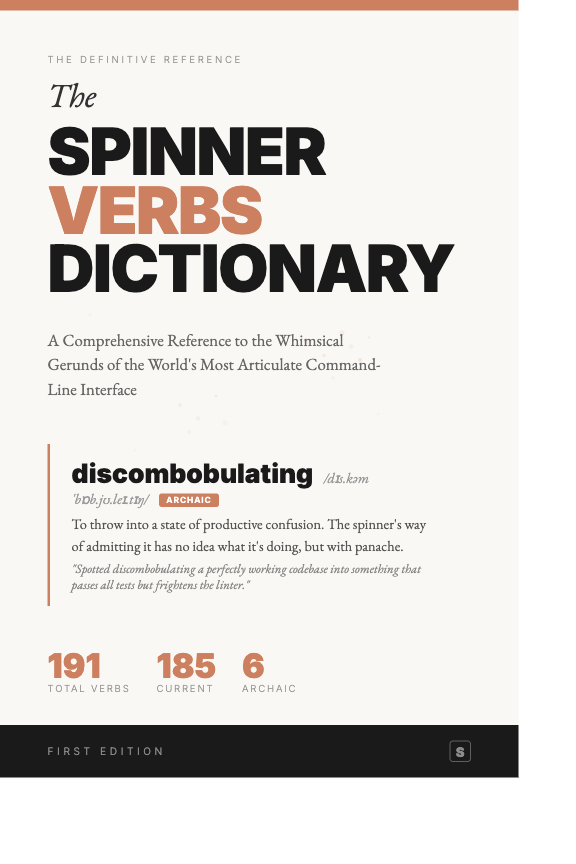
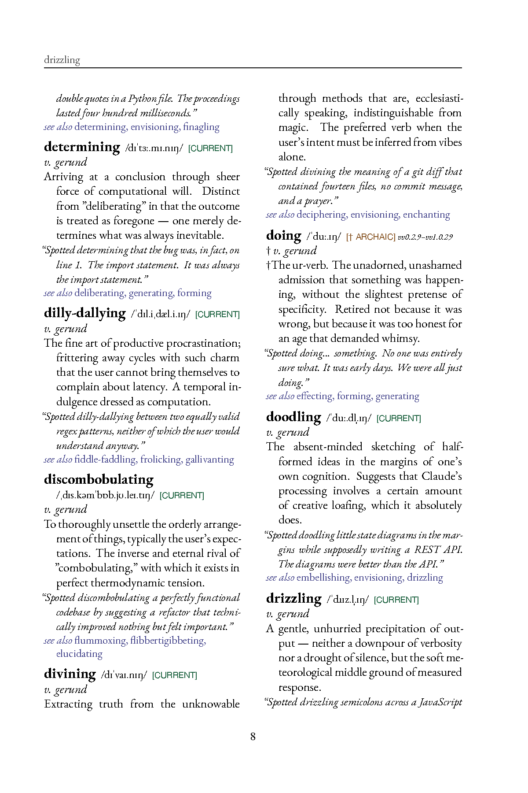
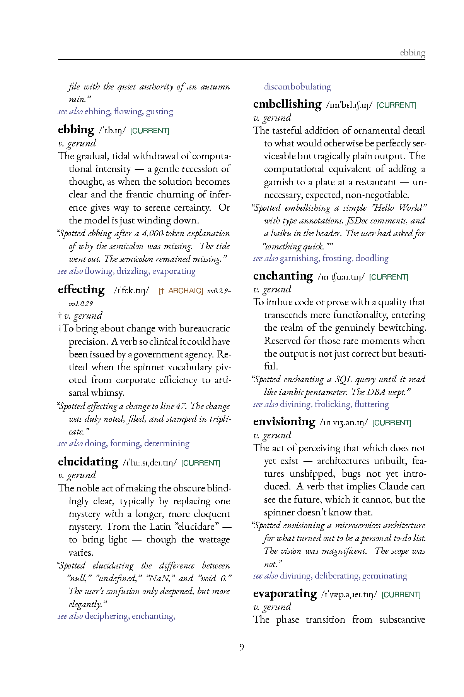
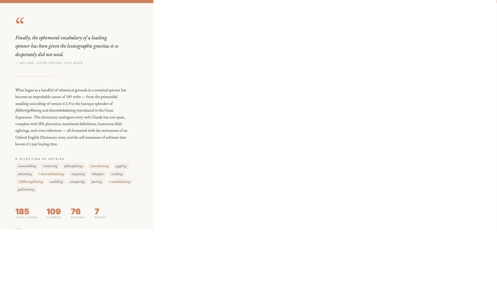

# The Spinner Verbs Dictionary

**185 Words an AI Mutters While Thinking — Defined, Translated, and Taken Far Too Seriously**

[**Download Free PDF**](The-Spinner-Verbs-Dictionary.pdf) &#183; [**Buy the Print Book**](#get-the-print-edition)

---

> *"Finally, the ephemeral vocabulary of a loading spinner has been given the lexicographic gravitas it so desperately did not need."*
>
> — No one, upon seeing this book

---

## What Is This?

While you wait for your AI assistant to respond, a single word spins in the terminal.

*Frolicking. Waddling. Discombobulating.*

These aren't random — they're the **spinner verbs**, a curated vocabulary of gerunds displayed by [Claude](https://claude.ai) while it thinks. They exist for a fraction of a second, then vanish.

They deserved a dictionary.

**The Spinner Verbs Dictionary** is a comprehensive, deadpan reference work cataloguing every spinner verb — current and retired — with the full gravitas of a leather-bound Oxford edition.

 
&nbsp;&nbsp;
  

## What's Inside

Each of the 191 entries includes:

- **IPA phonetic transcription** — because *discombobulating* deserves proper pronunciation guidance
- **Numbered definitions** with multiple senses, written with the gravity typically reserved for words that actually matter
- **Field sightings** — humorous "observations" of Claude performing the action
- **Cross-references** to related verbs (*waddling* → see also *moseying*)
- **Version history** — when each verb first appeared and, for the retired ones, when it was last seen alive

Retired verbs are marked with a dagger (†) and treated as **archaic** — complete with wistful definitions and "last sighted in v0.2.41" notes.

## A Sample Entry

> **discombobulating** /dɪsˌkɒm.ˈbɒb.jʊ.leɪ.tɪŋ/ *v. gerund* † ARCHAIC [v0.1.12–v0.2.41]
>
> To throw into a state of productive confusion. The spinner's way of admitting it has no idea what it's doing, but with panache.
>
> *"Spotted discombobulating a perfectly working codebase into something that passes all tests but frightens the linter."*
>
> → see also: **combobulating**, **flibbertigibbeting**

## By the Numbers

| | |
|---|---|
| **191** | Total verbs catalogued |
| **185** | Currently in active rotation |
| **6** | Retired to archaic status |
| **7** | Mood categories (Culinary, Kinetic, Cerebral, Whimsical, Scientific, Musical, Existential) |

## A Brief History of Spinner Verbs

**The Primordial Era** (v0.2.9–v0.2.41) saw the birth of 56 original verbs — a blend of the practical (*Computing*, *Processing*) and the playful (*Noodling*, *Honking*, *Vibing*).

**The Singular Addition** (v0.2.42) brought exactly one new verb: *Pontificating*. Its arrival was noted with appropriate ceremony.

**The Great Expansion** (v1.0.29) unleashed 33 new verbs upon the world, including such luminaries as *Flibbertigibbeting*, *Discombobulating*, and *Wizarding*. The tone shifted decisively toward whimsy.

**The Modern Era** (v1.0.49+) saw the roster swell to 185 verbs, embracing culinary arts (*Julienning*, *Sauteing*), dance (*Moonwalking*, *Sock-hopping*), and the frankly inexplicable (*Whatchamacalliting*).

Along the way, some verbs were quietly retired — victims of changing tastes or corporate sobriety initiatives.

## Download

### Free PDF

**[Download The Spinner Verbs Dictionary (PDF)](The-Spinner-Verbs-Dictionary.pdf)**

The complete English edition. Free. Because dictionaries of imaginary verb behaviors should be accessible to everyone.

### Get the Print Edition

For those who believe spinner verbs deserve to exist on physical paper, a professionally typeset paperback is available:

<!-- **[Buy on Amazon →](https://www.amazon.com/dp/PLACEHOLDER)** -->

*Print edition coming soon on Amazon KDP.*

The print book features two-column dictionary layout, guide words, and the kind of typographic care normally reserved for words that weren't invented by a loading spinner.

 

  

## Verbs by Mood

A subjective classification. Your mileage may vary.

**Culinary** — Baking, Brewing, Caramelizing, Cooking, Fermenting, Flambeing, Frosting, Garnishing, Julienning, Kneading, Leavening, Marinating, Proofing, Sauteing, Seasoning, Simmering, Stewing, Tempering, Whisking, Zesting

**Kinetic** — Cascading, Frolicking, Gallivanting, Galloping, Moonwalking, Scampering, Scurrying, Shimmying, Skedaddling, Waddling

**Cerebral** — Cerebrating, Cogitating, Contemplating, Deliberating, Musing, Philosophising, Pondering, Ruminating

**Whimsical** — Booping, Canoodling, Dilly-dallying, Flibbertigibbeting, Lollygagging, Razzle-dazzling, Shenaniganing, Tomfoolering, Topsy-turvying, Whatchamacalliting

**Scientific** — Crystallizing, Ionizing, Nebulizing, Nucleating, Osmosing, Photosynthesizing, Precipitating, Sublimating

**Musical** — Beboppin', Grooving, Harmonizing, Improvising, Jitterbugging, Jiving, Sock-hopping

**Existential** — Discombobulating, Flummoxing, Befuddling, Combobulating, Recombobulating

## License

This work is licensed under [CC BY-NC-SA 4.0](https://creativecommons.org/licenses/by-nc-sa/4.0/) — you're free to share and adapt it for non-commercial purposes with attribution.

---

Compiled with unreasonable seriousness.

